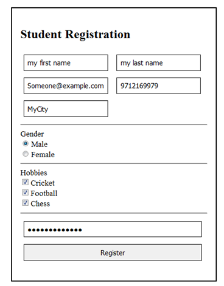

# Midterm Test / 중간고사


이 시험은 **OPEN BOOK**입니다. 인터넷, 책, 노트 등을 포함한 모든 자료를 사용할 수 있습니다. 시험 중에 다른 학생과 통신하거나 다른 자료를 사용할 수 없습니다.

---

## **TEST:** Instructions / **시험:** 지시사항

1. GitHub 스타터 파일 다운로드
2. Eclipse로 Git 프로젝트 가져오기
3. `속성 (Properties) -> 프로젝트 패싯 (Project Facets) -> 패싯 형태로 변환 (Convert to Faceted Form)...` (Java, Dynamic Web Module, Apache 서버 런타임 선택)
4. `views`에서 `src > main > webapp`로 `.html` 파일 이동
5. 모든 `.html` 파일 이름 변경
6. 각 페이지 상단에 JSP 페이지 지시문 추가 (`<%@ page contentType="text/html; charset =UTF-8" %>`)
7. `index.jsp`에서 `<header>` 태그의 모든 콘텐츠를 새 `header.jsp` 파일로 이동합니다. 그런 다음 JSP `include` 지시문 태그를 사용하여 동일한 위치에 파일을 가져옵니다.
8. `index.jsp`에서 `<footer>` 태그의 모든 콘텐츠를 새 `footer.jsp` 파일로 옮깁니다. `include` 태그를 사용하여 `footer` 파일을 같은 위치로 가져옵니다.
9. `register.jsp` 파일에서 그림에 표시된 대로 Form을 코딩합니다.
10. 양식이 제출되면 데이터가 서버로 전송되고 `thanks.jsp` 페이지가 새 사용자에게 환영 메시지와 함께 로드됩니다.
11. CSS, JS 및 IMG 링크가 모두 작동하는지 확인합니다(경로를 조정해야 할 수도 있음)
12. 웹사이트가 3개 페이지(`index.jsp`, `register.jsp` 및 `thanks.jsp`)에서 작동하는지 확인한 후 GitHub에 제출하세요!



---

### Given files / 주어진 파일

```bash
|___/views                    # <CHANGE> .ejs로 확장자 변경
| |___index.html                # GET 메소드로 접근 가능
| |___transportation.html       # GET 메소드로 접근 가능
| |___contact.html              # GET과 POST 메소드로 접근 가능
| |___thanks.html               # POST 메소드 후에 접근 가능
| |___error.html                # 에러 발생 시 접근 가능

|___/public                   # <NO CHANGES> 안 바뀜
| |___css
| | |___style.css
| | |___style.small.css         # 반응형 웹 디자인을 위한 CSS
| | |___bootstrap.min.css       # 부트스트랩 CSS
| | |___bootstrap.min.css.map   # 부트스트랩 CSS 맵
| | |___confetti.css            # thanks.html에 사용된 CSS
| |___img
| | |___dribbble_404.gif        # error.html에 사용된 이미지
| |___js
| | |___functions.js            # 반응형 메뉴를 위한 JS
| | |___bootstrap.bundle.min.js # 케러셀을 위한 부트스트랩 JS
| | |___bootstrap.bundle.min.js.map
```

---

### Requirements / 요구사항

다음 파일과 폴더가 프로젝트에 있어야 합니다.

```bash
|___/views

|___/src
| |___/main
| | |___/webapp
| | | |___header.jsp              # 모든 페이지에 사용되는 헤더
| | | |___footer.jsp              # 모든 페이지에 사용되는 푸터
| | | |___nav.jsp                 # 모든 페이지에 사용되는 네비게이션 바
| | | |___confetti.jsp            # (보너스) thanks.html에 사용되는 confetti
| | | |___index.jsp                 
| | | |___register.jsp            # 폼을 제출할 때 thanks.ejs 페이지로 이동...
| | | |___thanks.ejs              # 새로운 사용자가 등록하면 환영 메시지("안녕, <이름>!")를 표시

|___/public                   # <NO CHANGES> 안 바뀜
| |___css
| | |___style.css
| | |___style.small.css         # 반응형 웹 디자인을 위한 CSS
| | |___bootstrap.min.css       # 부트스트랩 CSS
| | |___bootstrap.min.css.map   # 부트스트랩 CSS 맵
| | |___confetti.css            # thanks.html에 사용된 CSS
| |___img
| | |___dribbble_404.gif        # error.html에 사용된 이미지
| |___js
| | |___functions.js            # 반응형 메뉴를 위한 JS
| | |___bootstrap.bundle.min.js # 케러셀을 위한 부트스트랩 JS
| | |___bootstrap.bundle.min.js.map
```
